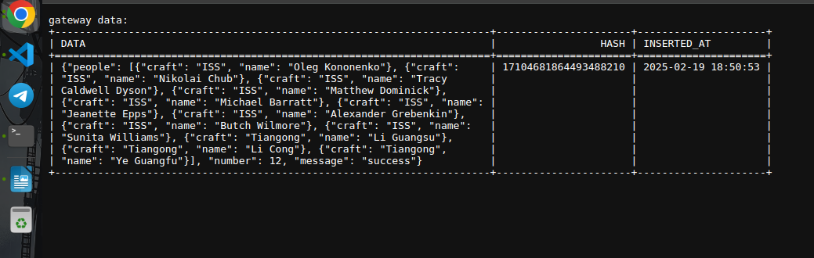
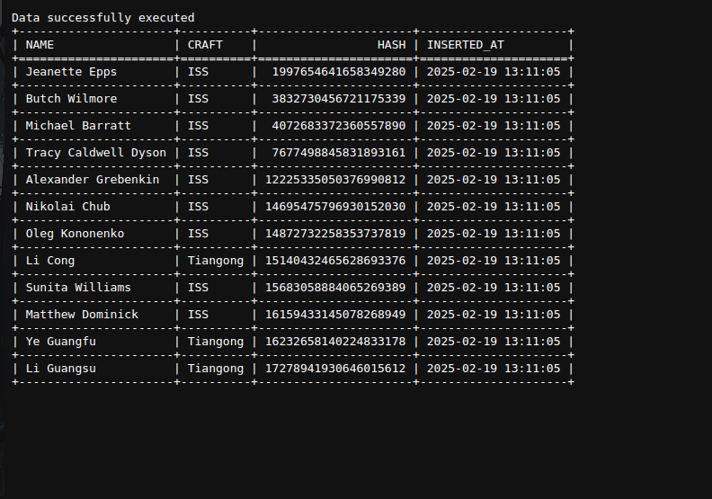

Техническое задание
===================

В этом разделе представлено техническое задание для проекта Test Clickhouse.

## Общие сведения

Проект Test Clickhouse предназначен для работы с базой данных Clickhouse. Он включает следующие модули и компоненты:

- `application`: Основная логика приложения
- `config`: Конфигурация проекта
- `controllers`: Контроллеры для обработки HTTP-запросов
- `infrastructure`: Инфраструктурные компоненты, такие как работа с базой данных
- `main`: Точка входа в приложение
- `ioc`: Создание DI контейнеров
## Требования

- Python 3.12
- Poetry для управления зависимостями

## Архитектура

Проект организован в виде модулей и пакетов, как показано ниже:


Структура проекта
=================
```
app
├── src
│   ├── application
│   │   ├── __init__.py
│   │   ├── interactors.py
│   │   ├── interfaces.py
│   ├── config.py
│   ├── controllers
│   │   ├── http.py
│   │   ├── __init__.py
│   │   └── schemas.py
│   ├── infrastructure
│   │   ├── database.py
│   │   ├── gateways.py
│   │   ├── __init__.py
│   │   ├── models
│   │   │   ├── __init__.py
│   │   │   └── tables_creation.py
│   │   ├── request.py
│   │   └── types.py
│   ├── ioc.py
│   └── main.py
├── docker_config
│   ├── config.xml
│   ├── create_image.sh
│   ├── supervisord.conf
│   └── users.xml
├── poetry.lock
├── pyproject.toml
├── README.md
├── run.sh
└── test.py
```


Быстрый старт
=============

Добро пожаловать в "Быстрый старт" для Test Clickhouse. В этом разделе вы найдете основные шаги для начала работы с проектом.

1. **Установка зависимостей**:
    Убедитесь, что у вас установлены все необходимые зависимости: `python3.12`, `docker`. Вы можете использовать `poetry` для установки зависимостей:

2. **Клонируйте репозиторий**

    ```sh
    git clone https://github.com/Pavel14701/test-clickhouse.git
    ```

3.  **Установите необходимые зависимости**
    ```sh
    poetry install
    ```

4.  **Создайте образ контейнера и запустите его**
    *Команда от корня проекта*

    Создание контенера:
    ```sh
    chmod +x docker_config/create_image.sh
    .docker_config/create_image.sh
    ```

    Запуск контенера:
    ```sh
    chmod +x docker_config/run_container.sh
    .docker_config/run_container.sh
    ```

5.  **Создайте таблицы и материальные представления**

    ```sh
    chmod +x run_table_creation.sh
    .docker_config/run_table_creation.sh
    ```

6.  **Запустите веб-приложение с помощью команды:**
    *Команда от корня проекта*

    
    ```sh
    chmod +x run.sh
    ./run.sh
    ```


Маршруты
=============
1.  **Сохранение сырого Json и запуск дедупликации**

        ```sh
        http://localhost:8080/save-json
        ```

    

2.  **Получение замапленного ответа**

        ```sh
        http://localhost:8080/people
        ```

    
